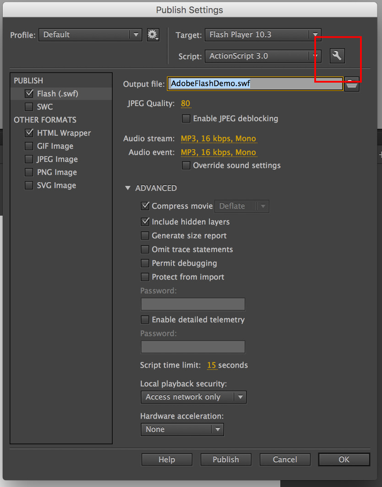
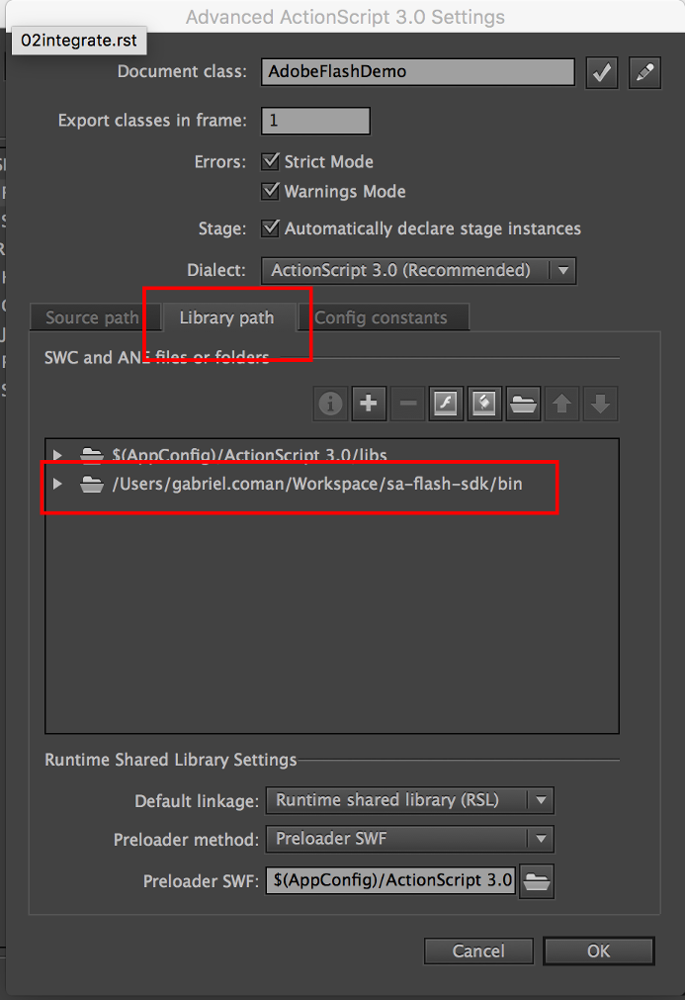
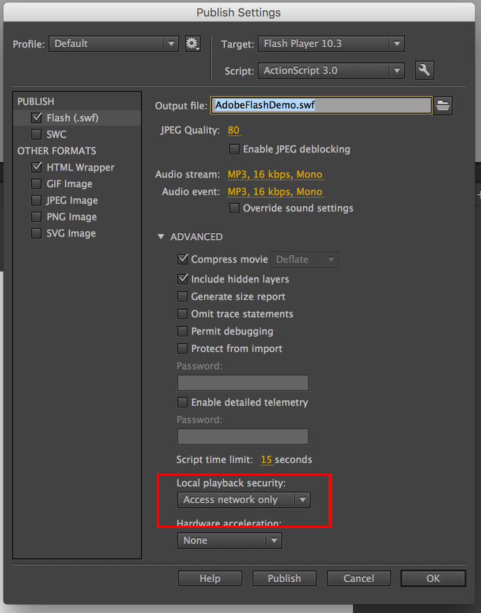

Integrate the SDK
=================

The new Flash SDK is compiled into `SuperAwesomeSDK-<sdk_version>.AdobeFlash.swc <https://github.com/SuperAwesomeLTD/sa-sdk-build-repo/blob/master/package/aa_flash/<sdk_version>/SuperAwesomeSDK-<sdk_version>.AdobeFlash.swc?raw=true>`_ .
You'll need to download this file and save it somewhere to disk, so you can add it to your project.

**Note:** This document assumes:

 * an Adobe Flash Professional CC project named **AdobeFlashDemo.fla**
 * a main class file called **AdobeFlashDemo.as**, containing
 * a single AdobeFlashDemo class, extending Sprite

Add the SDK
^^^^^^^^^^^

To add the SDK to the project, simply copy the file you just downloaded, `SuperAwesomeSDK-<sdk_version>.AdobeFlash.swc`, into
the project root and setup library paths:

Go to the **File -> Publish Settings** menu. A pop-up will appear with different settings. Press on the **Action Script 3 Settings** button.

There, in the **Library path** tab, add the relative or absolute path to where you have saved the two files (in this case, the `/project_root` folder). In this way, your whole project will have access to the SDK.

Press OK and then make sure that in the **Publish Settings** menu the **Local playback security** option is set to **Access network only**.

